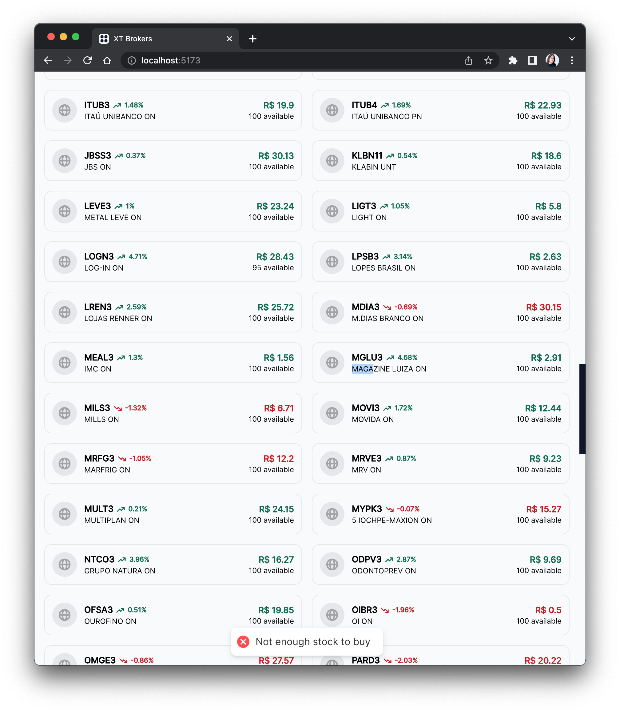

# Decisões

## História de Desenvolvimento

Antes de iniciar o desenvolvimento do aplicativo, eu primeiro pensei nas expectativas de experiência que um trader teria com o aplicativo.

- ### A primeira e <strong>mais importante</strong> expectativa é que o estado do aplicativo reflita a estado atual do mercado financeiro em tempo real.

    Se coloque no lugar do trader nessa situação:

    > O estado do aplicativo diz que a quantidade de MGLU3 na corretora é 100
    

    > O estado real da corretora da quantidade de MGLU3 disponível é apenas 9, resultando num erro na hora de compra mesmo que a expectativa seja de sucesso.
    

    Essa diferença é muito frustrante para o trader, pois ele não sabe o que está acontecendo no mercado financeiro. A verdade só é refletida na sua tela se ele refrescar a página o tempo todo. E essa é uma experiência péssima.

    Com isso em mente, eu sabia que deveria focar em uma solução backend com suporte à comunicação por websockets. Assim, o estado do banco de dados sempre será refletido em tempo real na tela do trader.

    Visto o tempo limite de entrega, eu julguei que seria inviável implementar meu back-end do zero com conexão por websocket E fazer o front-end ao mesmo tempo.

    Eu havia duas opções em mente:

    - Firebase Firestore, um serviço de infraestrutura com banco de dados NoSQL que me permite atualizar dados em tempo real ou

    - Supabase, uma alternativa ao Firebase que utiliza e cria apenas código open-source contruído em cima do PostgreSQL.

    Eu já havia feito um aplicativo extremamente similar no passado, o <a href="https://espressowallet.com">espressowallet</a>, que utiliza o Firebase como backend.

    Eu poderia ter feito o aplicativo com o Firebase e provavelmente ter entregue muito mais rápido e com mais qualidade visto que já sou familiarizado, mas o objetivo aqui é me desafiar então eu escolhi o Supabase.

- ### O trader espera que todsas as informações relevantes no momento do trade de algum ativo devem estar aparentes na interface.

    Por exemplo, se eu quiser comprar MGLU3, eu deveria ver na tela:

    - O preço atual do MGLU3
    - A variação do preço do MGLU3
    - A quantidade de MGLU3 disponível na corretora
    - A quantidade de MGLU3 que eu tenho na minha carteira

    Tudo isso deve ser aparente na tela para que o trader faça uma decisão informada.

    Por isso eu deixei o Modal de trade bem populado com todas essas informações.

- ### O trader espera que o carregamente e transição de páginas seja rápida.

    Pesquisas frequentemente demonstram uma correlação forte entre tempo de carregamento e qualidade da experiência do usuário.

    Para atingir tal, eu precisaria usar algum framework com suporte à code splitting.

    Se eu soubesse que havia liberdade de utilizar qualquer livraria antes de iniciar o projeto, eu teria utilizado <a href="https://solidjs.com">SolidJS</a>, uma ótima alternativa ao React.

    Como não sabia, eu acabei por usar o bom e velho React mesmo.

- ### Se algum erro ocorreu no banco de dados, o trader deve ser notificado na interface.

    Por exemplo, se algo que deveria ter sido salvo no banco de dados não foi, o trader deveria ser notificado. Caso contrário ele não vai estar ciente do que ocorreu com o seu patrimônio e isso seria inaceitável.

    Outro bom motivo é interno. Se ocorreu algo de errado na nossa parte, o usuário deveria ser capaz de notificar os desenvolvedores.

    Por isso eu deixei o sistema de notificação de erro bem configurado com a livraria React Hot Toast.

- ### O trader precisa ser capaz de visualizar todo o valor do seu patrimônio.

    Se ocorreu alguma variação de preço brusca, o trader precisa saber que o valor do seu patrimônio está variando.

    Eu gostaria de ter mais tempo para configurar uma página dedicada ao patrimônio do trader. Mas o tempo limite de entrega não é muito longo, então eu deixei apenas o valor monetário no topo da página.

    Se eu fosse refazer o aplicativo, eu colocaria mais prioridade em fazer gráficos utilizando uma livraria como <a href="https://formidable.com/open-source/victory/">Victory</a>


- ### O trader espera ser introduzido à platafroma com uma experiência de onboarding

    Eu gostaria de ter um onboarding rápido para que o trader possa entender como o aplicativo funciona.

    É imprescindível que o usuário entenda como utilizar a plataforma, e como fazer trades. E as vezes uma interface intuitiva não é suficiente.

- ### O trader espera que o seus dados sejam mantidos seguros.

    Um dos motivos pelo qual Firebase é bom é que é um banco de dados seguro e confiável.

    Supabase ainda está na sua infância, mas é promissor.

    No Supabase, a segurança e privacidade dos dados é mantida a nível do próprio banco de dados, com políticas de <em>Row Level Security</em> (RLS). Isso significa que um usuário só pode acessar certas fileiras na tabela caso alguma certa condição seja verdadeira.

    O Supabase possui plugins de fácil configuração com JWT para verificar a autenticidade do usuário.

    Um exemplo de política de segurança a nível de fileira é a seguinte implementada no banco de dados:

    ```plpgsql
    CREATE POLICY "Enable users to only read their own data" ON "public"."clientes"
    AS PERMISSIVE FOR SELECT
    TO public
    USING (auth.uid() = "codCliente")
    ```

    Isso significa que apenas o usuário com o codCliente igual ao auth.uid() fornecido pelo plugin de JWT do supabase pode ler o que está escrito na tabela clientes.

    Essas regras de segurança também se aplicam à escuta em tempo real das mudanças na tabela pelo Supabase Realtime.

## Escolha de tecnologias

### Front End

#### [React 18](https://reactjs.org/)
- API declarativa, curta, fácil de usar e aprender.
- Componentes reutilizáveis, flexíveis e funcionais.
- Reutilização de lógica com hooks.
- Reutilização de lógica entre React.js e React Native.
- Comunidade de desenvolvedores enorme com inúmeras livrarias.
- React 18 introduz o componente `Suspense` para permitir que os componentes carreguem apenas quando requeridos.

#### [React Router v6](https://reactrouter.com/)
- Suporte a rotas dinâmicas e estáticas.
- Suporte a rotas com parâmetros.
- Fácil de implementar rotas protegidas e rotas aninhadas.
- Facilita o desenvolvimento de <em>Single Page Apps</em>.

#### [Tailwind](https://tailwindcss.com/)
- Incrível framework de estilização para CSS com classes de utilidade.
- Suporte ao uso de pseudo-classes.
- Ferramentas de autocomplete no VSCode.
- Altamente flexível e customizável.

#### [Flowbite](https://flowbite.com/)
- Livraria de componentes compatíveis com Tailwind.
- Mantém a flexibilidade do Tailwind.
- Diminui o tempo de desenvolvimento.

#### [Framer Motion](https://framer.com/motion/)
- Livraria de componentes para animações.
- API declarativa para animações de entrada e saída de componentes.
- Aceleração de gráficos com uso da GPU para animações.

#### [Hero Icons](https://heroicons.com/)
- Livraria de ícones compatíveis com Tailwind.

#### [React Hot Toast](https://react-hot-toast.com/)
- Livraria de <em>Toasts</em> para React.js.
- Extremamente fácil de configurar.
- Boas animações por padrão.
- Altamente flexível e customizável.
- Uma ótima escolha para dar feedback de erro e sucesso.

#### [Immer](https://immerjs.github.io/immer/)
- Livraria de utilidades para manipular estados de componentes.
- Faz com que a mudança de estado seja mais fácil de manusear e ler.<br>
  Exemplo:
    ```js
    const baseState = [
        {
            title: "Learn TypeScript",
            done: true
        },
        {
            title: "Try Immer",
            done: false
        }
    ]

    // Sem immer:
    const nextState = baseState.slice()

    nextState[1] = {
        ...nextState[1],
        done: true
    }

    setState(nextState)

    // Com immer:
    setState(produce(draft => { draft[1].done = true }))
    ```


### Back End

#### [Supabase](https://supabase.com/)
- Plataforma open source construída em cima do Postgres.
- Suporte a autenticação com JWT com plugins.
- Fácil de configurar (<em>'Build in a weekend. Scale to millions.'</em>)
- Interface gráfica versátil, completa e intuitiva.
- Interfaces Realtime, GRAPHQL, REST criadas automaticamente.
- SDKs disponíveis para Dart, JS e Python.

Como eu configurei o banco de dados utilizando apenas a interface gráfica do Supabase, eu vou explicar aqui como foram implementadas as regras de segurança, schema, triggers, RPCs, endpoints etc...

Basicamente, o SDK do Supabase se comunica diretamente com o banco de dados, e as regras de negócio são implementadas [diretamente no banco de dados sem o intermédio de uma API](https://youtu.be/Ow_Uzedfohk). Mais informações sobre o Supabase [aqui](https://supabase.com/docs/getting-started).

#### Schema

O Schema define a estrutura do banco de dados e suas tabelas.

- Tabela de clientes
    ```
    public.clientes
        codCliente (uuid) (PK)
        email (varchar)
        saldo (float4)
        criado (timestamptz)
    ```

- Tabela de ativos cadastrados na corretora
    ```
    public.investimentos
        codAtivo (varchar) (PK)
        nomeAtivo (varchar) (unique)
        valor (float4)
        qtdeAtivo (int2)
        variacao (float4)
    ```

- Tabela intermediária que contém todos os investimentos de todos os clientes
    ```
    public.clientesInvestimentos:
        id (int8) (PK)
        codAtivo (varchar) (FK)
        codCliente (uuid) (FK)
        qtdeAtivo (int2)
    ```

- Tabela com todas as transações
    ```
    public.transacoes:
        id (int8) (PK)
        codCliente (uuid) (FK) (nullable) - inicialmente nulo pois é preenchido através de triggers
        codAtivo (varchar) (FK)
        qtdeAtivo (int2)
        venda (bool)
        valor (float4) (nullable) -- inicialmente nulo pois é preenchido através de triggers
    ```

### Regras de Segurança a nível de fileira

    ```plpgsql
    -- public.clientes:
    -- SELECT
    CREATE POLICY "Enable users to only read their own data" ON "public"."clientes"
    AS PERMISSIVE FOR SELECT
    TO public
    USING (auth.uid() = "codCliente")
    ```

    ```plpgsql
    -- public.clientesInvestimentos:
    -- SELECT
    CREATE POLICY "Enable users to only read their down portfolio" ON "public"."clientesInvestimentos"
    AS PERMISSIVE FOR SELECT
    TO public
    USING (auth.uid() = "codCliente")
    ```

    ```plpgsql
    -- public.investimentos:
    -- SELECT
    CREATE POLICY "Enable read access for everyone" ON "public"."investimentos"
    AS PERMISSIVE FOR SELECT
    TO public
    USING (true)
    ```

    ```plpgsql
    -- public.transacoes:
    -- INSERT
    CREATE POLICY "Enable insert for authenticated users only" ON "public"."transacoes"
    AS PERMISSIVE FOR INSERT
    TO authenticated

    WITH CHECK (true)

    -- SELECT
    CREATE POLICY "Enable users to only read their own transactions" ON "public"."transacoes"
    AS PERMISSIVE FOR SELECT
    TO public
    USING (auth.uid() = "codCliente")
    ```
### Triggers

Triggers são funções que são executadas automaticamente assim que certa mudança for feita no banco de dados.

A lógica mais importante do banco de dados está descrita no trigger abaixo.

Basicamente, as regras de segurança determinam que nenhum usuário pode inserir, atualizar quaisquer dados em qualquer tabela. Os usuários só podem ler os próprios dados e os ativos da corretora na tabela public.investimentos.

A única exceção é inserir novas transações. O validez da transação é verificada exclusivamente pelo trigger abaixo, e os valor da transação é calculado automaticamente.

As colunas de saldo do cliente, de qtdeAtivo do cliente e qtdeAtivo da corretora também são atualizadas automaticamente no trigger abaixo.

Quando o assunto é atualizar o valor do saldo do cliente, são utilizadas Chamadas Remotas de Prodecimento (RPC's) para atualizar o saldo do cliente no banco de dados. Ela é descrita na seção RPC's.

- Quando um cliente envia uma nova transação, o trigger abaixo é executado:
    ```plpgsql
    CREATE OR REPLACE FUNCTION public.transacoes_trigger()
    RETURNS TRIGGER AS $BODY$
    BEGIN
        -- Se o cliente tentar enviar quantidades negativos, lança exceção
        IF (NEW."qtdeAtivo" < 0) THEN
            RAISE EXCEPTION 'Invalid transaction';
        END IF;

        -- Define o valor da "NOVA" transação baseado no valor atual do ativo e a quantidade solicitada
        NEW."valor" := NEW."qtdeAtivo" * (SELECT "valor" FROM public."investimentos" WHERE "codAtivo" = NEW."codAtivo");

        -- Popula a coluna de código de cliente automaticamente baseado no token JWT
        NEW."codCliente" := auth.uid();

        -- Se for uma venda
        IF NEW.venda THEN

            -- Verifica se o cliente tem o ativo para vender
            IF NOT EXISTS(SELECT "qtdeAtivo" FROM public."clientesInvestimentos" WHERE "codCliente" = NEW."codCliente" AND "codAtivo" = NEW."codAtivo" LIMIT 1) THEN
                RAISE EXCEPTION 'You dont have enough stock to sell';
            END IF;

            -- Verifica se o cliente tem ativos o suficiente para vender
            IF NEW."qtdeAtivo" > (SELECT "qtdeAtivo" FROM public."clientesInvestimentos" WHERE "codCliente" = NEW."codCliente" AND "codAtivo" = NEW."codAtivo" LIMIT 1) THEN
                RAISE EXCEPTION 'You dont have enough stock to sell';
            END IF;

            -- Se tudo estiver ok, diminui a quantidade de ativos do cliente
            UPDATE public."clientesInvestimentos" SET "qtdeAtivo" = "qtdeAtivo" - NEW."qtdeAtivo" WHERE "codCliente" = NEW."codCliente" AND "codAtivo" = NEW."codAtivo";

            -- Se todos os ativos do cliente foram vendidos, remove esse ativo da fileira clientesInvestimentos
            IF (SELECT "qtdeAtivo" FROM public."clientesInvestimentos" WHERE "codCliente" = NEW."codCliente" AND "codAtivo" = NEW."codAtivo" LIMIT 1) = 0 THEN
                DELETE FROM public."clientesInvestimentos" WHERE "codCliente" = NEW."codCliente" AND "codAtivo" = NEW."codAtivo";
            END IF;

            -- Augmenta o saldo do cliente baseado no valor da venda
            UPDATE public."investimentos" SET "qtdeAtivo" = "qtdeAtivo" + NEW."qtdeAtivo" WHERE "codAtivo" = NEW."codAtivo";
            UPDATE public.clientes SET "saldo" = "saldo" + NEW."valor" WHERE "codCliente" = NEW."codCliente";

        -- Se for uma compra
        ELSE
            -- Verifica se a quantidade requerida está disponível
            IF NEW."qtdeAtivo" > (SELECT "qtdeAtivo" FROM public."investimentos" WHERE "codAtivo" = NEW."codAtivo") THEN
                RAISE EXCEPTION 'Not enough stock to buy';
            END IF;

            -- Verifica se o cliente tem o saldo suficiente para comprar
            IF NEW."valor" > (SELECT "saldo" FROM public.clientes WHERE "codCliente" = NEW."codCliente") THEN
                RAISE EXCEPTION 'You dont have enough money to buy';
            END IF;

            -- Se tudo estiver ok, diminui o a quantidade ativos disponiveis na corretora
            UPDATE public."investimentos" SET "qtdeAtivo" = "qtdeAtivo" - NEW."qtdeAtivo" WHERE "codAtivo" = NEW."codAtivo";

            -- Se o cliente já possui o ativo, atualiza a quantidade de ativos do cliente
            IF EXISTS(SELECT * FROM public."clientesInvestimentos" WHERE "codCliente" = NEW."codCliente" AND "codAtivo" = NEW."codAtivo") THEN
                UPDATE public."clientesInvestimentos" SET "qtdeAtivo" = "qtdeAtivo" + NEW."qtdeAtivo" WHERE "codCliente" = NEW."codCliente" AND "codAtivo" = NEW."codAtivo";

            -- Se o cliente não possui o ativo, adiciona o ativo ao cliente
            ELSE
                INSERT INTO public."clientesInvestimentos" ("codCliente", "codAtivo", "qtdeAtivo") VALUES (NEW."codCliente", NEW."codAtivo", NEW."qtdeAtivo");
            END IF;

            -- Diminui o saldo do cliente baseado no valor da compra
            UPDATE public.clientes SET "saldo" = "saldo" - NEW."valor" WHERE "codCliente" = NEW."codCliente";
        END IF;

        -- Insere a transação no banco de dados
        RETURN NEW;
    END;
    ```

### Chamada Remota de Procedimento (Remote Procedure Call)

As funções abaixo são chamadas pelo front-end para executar as ações no back-end.

Por exemplo, invés de ir atrás utilizar um endpoint PATCH para atualizar o saldo, é possível apenas chamar essa função com tais parâmetros para realizar essa ação.

- A função abaixo é responsável pelo depósito e retirada de dinheiro do cliente. Ela recebe o valor como parâmetro e o código do cliente é obtido pelo token JWT.
    ```plpgsql
    CREATE OR REPLACE FUNCTION increment(amount float)
    RETURNS float AS $BODY$
    DECLARE
    -- Declara a variável que receberá o valor do saldo do cliente
    funds float;
    BEGIN
        -- Busca o saldo do cliente pelo id no JWT e armazena na variável
        SELECT saldo INTO funds FROM public.clientes WHERE "codCliente" = auth.uid();

        -- Soma o valor ao saldo do cliente
        funds = funds + amount;

        -- Se o novo valor for menor que 0, lança exceção
        IF funds < 0 THEN
            RAISE EXCEPTION 'Your withdraw amount exceeds your funds';
        END IF;

        -- Atualiza o saldo do cliente
        UPDATE public.clientes SET "saldo" = funds WHERE "codCliente" = auth.uid();

        -- Retorna o saldo atualizado para o front-end
        RETURN funds;
    END;
    ```

### Endpoints

Todos os endpoints utilizados, assim como os endpoints listados nos requisitos do desafio Back End podem ser encontrados na pasta `<root>/src/api`

### Outros
Foram feitas algumas outras mudanças para adaptar o banco de dados à necessidade da aplicação.

Por exemplo, por padrão o PostgreSQL não envia de volta a fileira deletada numa ação DELETE. Para informar o usuário em tempo real que tal fileira foi deletada (exemplo, um dos seus ativos), foi criada essa função que retorna ao front-end a fileira deletada para que se possa remover ela do estado atual da aplicação.

```plpgsql
ALTER TABLE public."clientesInvestimentos" REPLICA IDENTITY FULL;
```

Outro problema que foi encontrado foi na configuração/implementação/establidade da funcionalidade Realtime do Supabase. Eu fiquei horas tentando resolver o problema, mas não consegui. Por fim, eu tentei abrir um <a href="https://github.com/supabase/realtime/issues/268">issue</a> no GitHub e aparentemente era um problema do Supabase.

Após executar esse <a href="https://github.com/supabase/realtime/issues/268#issuecomment-1193184394">script</a> no console do Postgres tudo voltou a funcionar perfeitamente 

# Muito obrigado por ler até aqui! ❤️
