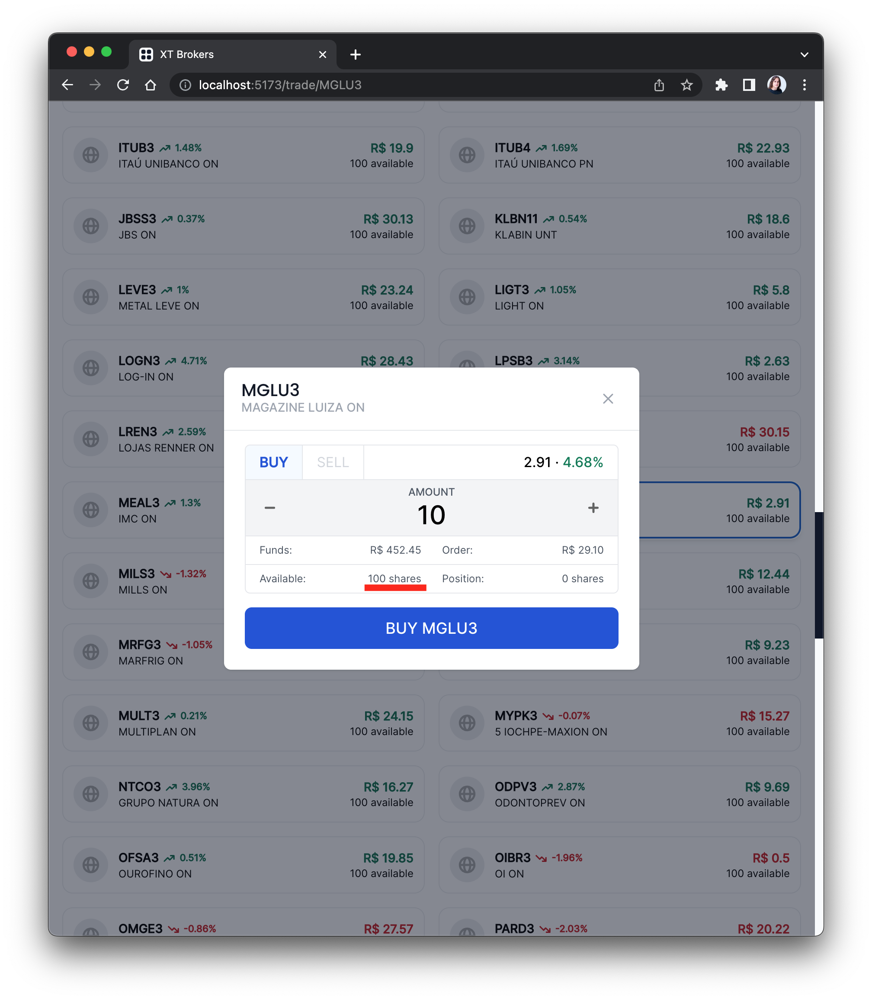
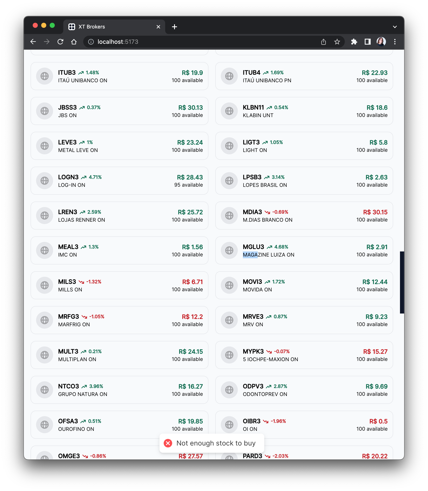

# Motivação

## História de Desenvolvimento

Antes de iniciar o desenvolvimento do aplicativo, eu primeiro pensei nas expectativas de experiência que um trader teria com o aplicativo.

- A primeira e <strong>mais importante</strong> expectativa é que o estado do aplicativo reflita a estado atual do mercado financeiro em tempo real.

    Se coloque no lugar do trader nessa situação:

    > O estado do aplicativo diz que a quantidade de MGLU3 na corretora é 100
    

    > O estado real da corretora da quantidade de MGLU3 disponível é apenas 9, resultando num erro na hora de compra mesmo que a expectativa seja de sucesso.
    

    Essa diferença é muito frustrante para o trader, pois ele não sabe o que está acontecendo no mercado financeiro. A verdade só é refletida na sua tela se ele refrescar a página o tempo todo. E essa é uma experiência péssima.

    Com isso em mente, eu sabia que deveria focar em uma solução backend com suporte à comunicação por websockets. Assim, o estado do banco de dados sempre será refletido em tempo real na tela do trader.

    Visto o tempo limite de entrega, eu julguei que seria inviável implementar meu back-end do zero com conexão por websocket E fazer o front-end ao mesmo tempo.

    Eu havia duas opções em mente:

    - Firebase Firestore, um serviço de infraestrutura com banco de dados NoSQL que me permite atualizar dados em tempo real ou

    - Supabase, uma alternativa ao Firebase que utiliza e cria apenas código open-source contruído em cima do PostgreSQL.

    Eu já havia feito um aplicativo extremamente similar no passado, o <a href="https://espressowallet.com">espressowallet</a>, que utiliza o Firebase como backend.

    Eu poderia ter feito o aplicativo com o Firebase e provavelmente ter entregue muito mais rápido e com mais qualidade visto que já sou familiarizado, mas decidi que isso não o objetivo aqui é me desafiar então eu escolhi o Supabase.

- Todas as informações relevantes no momento do trade de algum ativo deve estar aparente na interface.

    Por exemplo, se eu quiser comprar MGLU3, eu deveria ver na tela:

    - O preço atual do MGLU3
    - A variação do preço do MGLU3
    - A quantidade de MGLU3 disponível na corretora
    - A quantidade de MGLU3 que eu tenho na minha carteira

    Tudo isso deve ser aparente na tela para que o trader faça uma decisão informada.

    Por isso eu deixei o Modal de trade bem populado com todas essas informações.

- Uma outra expectativa importante é que o carregamente e transição de páginas seja rápida.

    Pesquisas frequentemente demonstram uma correlação forte entre tempo de carregamento e qualidade da experiência do usuário.

    Para atingir tal, eu precisaria usar algum framework com suporte à code splitting.

    Se eu soubesse que havia liberdade de utilizar qualquer livraria antes de iniciar o projeto, eu teria utilizado <a href="https://solidjs.com">SolidJS</a>, uma ótima alternativa ao React.

    Como não sabia, eu acabei por usar o bom e velho React mesmo.

- Se algum erro ocorreu no banco de dados, o trader deveria ser notificado na interface.

    Por exemplo, se algo que deveria ter sido salvo no banco de dados não foi, o trader deveria ser notificado. Caso contrário ele não vai estar ciente do que ocorreu com o seu patrimônio e isso seria inaceitável.

    Outro bom motivo é interno. Se ocorreu algo de errado na nossa parte, o usuário deveria ser capaz de notificar os desenvolvedores.

    Por isso eu deixei o sistema de notificação de erro bem configurado com a livraria React Hot Toast.

- O trader deveria ser capaz de visualizar todo o valor do seu patrimônio em renda variável também.

    Se ocorreu alguma variação de preço brusca, o trader precisa saber que o valor do seu patrimônio está variando.

    Eu gostaria de ter mais tempo para configurar uma página dedicada ao patrimônio do trader. Mas o tempo limite de entrega não é muito longo, então eu deixei apenas o valor monetário no topo da página.

    Se eu fosse refazer o aplicativo, eu colocaria mais prioridade em fazer gráficos utilizando uma livraria como <a href="https://formidable.com/open-source/victory/">Victory</a>


- O usuario deveria ser educado com uma experiência de onboarding

    Eu gostaria de ter um onboarding rápido para que o trader possa entender como o aplicativo funciona.

    É imprescindível que o usuário entenda como utilizar a plataforma, e como fazer trades. E as vezes uma interface intuitiva não é suficiente.

- O trader espera que o seus dados sejam mantidos seguros.

    Um dos motivos pelo qual Firebase é bom é que é um banco de dados seguro e confiável.

    Supabase ainda está na sua infância, mas é promissor.

    No Supabase, a segurança e privacidade dos dados é mantida a nível do próprio banco de dados, com políticas de <em>Row Level Security</em> (RLS). Isso significa que um usuário só pode acessar certas fileiras na tabela caso alguma certa condição seja verdadeira.

    O Supabase possui plugins de fácil configuração com JWT para verificar a autenticidade do usuário.

    Um exemplo de política de segurança a nível de fileira é a seguinte implementada no banco de dados:

    ```plpgsql
    CREATE POLICY "Enable users to only read their own data" ON "public"."clientes"
    AS PERMISSIVE FOR SELECT
    TO public
    USING (auth.uid() = "codCliente")
    ```

    Isso significa que apenas o usuário com o codCliente igual ao auth.uid() fornecido pelo plugin de JWT do supabase pode ler o que está escrito na tabela clientes.

    Essas regras de segurança também se aplicam à escuta em tempo real das mudanças na tabela pelo Supabase Realtime.

## Escolha de tecnologias

### Front End

#### [React 18](https://reactjs.org/)
- API declarativa, curta, fácil de usar e aprender.
- Componentes reutilizáveis, flexíveis e funcionais.
- Reutilização de lógica com hooks.
- Reutilização de lógica entre React.js e React Native.
- Comunidade de desenvolvedores enorme com inúmeras livrarias.
- React 18 introduz o componente `Suspense` para permitir que os componentes carreguem apenas quando requeridos.

#### [React Router v6](https://reactrouter.com/)
- Suporte a rotas dinâmicas e estáticas.
- Suporte a rotas com parâmetros.
- Fácil de implementar rotas protegidas e rotas aninhadas.
- Facilita o desenvolvimento de <em>Single Page Apps</em>.

#### [Tailwind](https://tailwindcss.com/)
- Incrível framework de estilização para CSS com classes de utilidade.
- Suporte ao uso de pseudo-classes.
- Ferramentas de autocomplete no VSCode.
- Altamente flexível e customizável.

#### [Flowbite](https://flowbite.com/)
- Livraria de componentes compatíveis com Tailwind.
- Mantém a flexibilidade do Tailwind.
- Diminui o tempo de desenvolvimento.

#### [Framer Motion](https://framer.com/motion/)
- Livraria de componentes para animações.
- API declarativa para animações de entrada e saída de componentes.
- Aceleração de gráficos com uso da GPU para animações.

#### [Hero Icons](https://heroicons.com/)
- Livraria de ícones compatíveis com Tailwind.

#### [React Hot Toast](https://react-hot-toast.com/)
- Livraria de <em>Toasts</em> para React.js.
- Extremamente fácil de configurar.
- Boas animações por padrão.
- Altamente flexível e customizável.
- Uma ótima escolha para dar feedback de erro e sucesso.

#### [Immer](https://immerjs.github.io/immer/)
- Livraria de utilidades para manipular estados de componentes.
- Faz com que a mudança de estado seja mais fácil de manusear e ler.

### Back End

#### [Supabase]